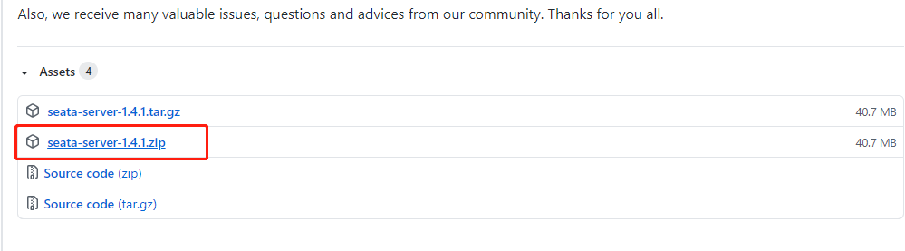
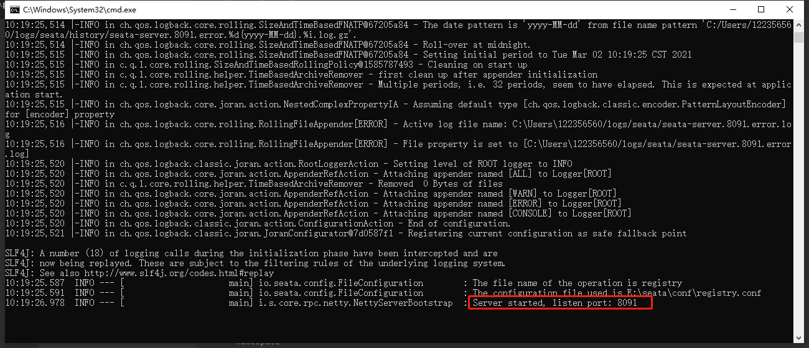
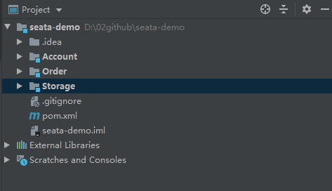

# 一、Seata 简介

查看源码  https://github.com/Xiao-Y/seata-demo

[查看源码](https://github.com/Xiao-Y/seata-demo) [查看源码](https://github.com/Xiao-Y/seata-demo) [查看源码](https://github.com/Xiao-Y/seata-demo) [查看源码](https://github.com/Xiao-Y/seata-demo)

## 1. Seata 如何处理呢


Business 是业务入口，在程序中会通过**注解**来说明他是一个**全局事务**，这时他的角色为 TM（事务管理者）。

Business 会请求 TC（事务协调器，一个独立运行的服务），说明自己要开启一个全局事务，TC 会生成一个全局事务ID（XID），并返回给 Business。

Business 得到 XID 后，开始调用微服务，例如调用 Storage。

Storage 会收到 XID，知道自己的事务属于这个全局事务。Storage 执行自己的业务逻辑，操作本地数据库。

Storage 会把自己的事务注册到 TC，作为这个 XID 下面的一个**分支事务**，并且把自己的事务执行结果也告诉 TC。

此时 Storage 的角色是 RM（资源管理者），资源是指本地数据库。

Order、Account 的执行逻辑与 Storage 一致。

在各个微服务都执行完成后，TC 可以知道 XID 下各个分支事务的执行结果，TM（Business） 也就知道了。

Business 如果发现各个微服务的本地事务都执行成功了，就请求 TC 对这个 XID 提交，否则回滚。

TC 收到请求后，向 XID 下的所有分支事务发起相应请求。

各个微服务收到 TC 的请求后，执行相应指令，并把执行结果上报 TC


## 2. 核心组件

- 事务协调器 TC：维护全局和分支事务的状态，指示全局提交或者回滚。

- 事务管理者 TM：开启、提交或者回滚一个全局事务。

- 资源管理者 RM：管理执行分支事务的那些资源，向TC注册分支事务、上报分支事务状态、控制分支事务的提交或者回滚。

## 3. 具体工作过程


- TM 请求 TC，开始一个新的全局事务，TC 会为这个全局事务生成一个 XID。
- XID 通过微服务的调用链传递到其他微服务。
- RM 把本地事务作为这个XID的分支事务注册到TC。
- TM 请求 TC 对这个 XID 进行提交或回滚。
- TC 指挥这个 XID 下面的所有分支事务进行提交、回滚。

# 二、Seata 详细工作流程示例


# 三、启动 seata 服务端

## 1. 下载seatea 服务端



## 2.修改 `config.txt` 文件，根据需要保存。修改数据库相关

`config.txt` 文件在源码中需要下载 Source code(zip) 解压后 `seata-1.4.1\script\config-center`。

执行 `seata-1.4.1\script\config-center\nacos\nacos-config.sh` 将配置文件导入到 nacos 中

`nacos-config.sh -h localhost -p 8848 -g SEATA_GROUP -t 0af6e97b-a684-4647-b696-7c6d42aecce7 -u nacos -w nacos`

例如 `nacos-config.sh -h 119.23.27.78 -p 8761 -g SEATA_GROUP -u nacos -w nacos`

```properties
service.vgroupMapping.my_test_tx_group=default
service.default.grouplist=127.0.0.1:8091
store.mode=db
store.db.datasource=druid
store.db.dbType=mysql
store.db.driverClassName=com.mysql.cj.jdbc.Driver
store.db.url=jdbc:mysql://127.0.0.1:3306/seata?useUnicode=true&characterEncoding=utf8&useSSL=false&autoReconnect=true&serverTimezone=Asia/Shanghai
store.db.user=root
store.db.password=root
```


## 3.修改 `registry.conf` 文件，修改 nacos 的地址、用户名和密码。

配置信息从 nacos 中获取（就是上面导入的）

```yaml
# 注册中心配置
registry {
  # file 、nacos 、eureka、redis、zk、consul、etcd3、sofa
  type = "nacos"
  loadBalance = "RandomLoadBalance"
  loadBalanceVirtualNodes = 10
  nacos {
    application = "seata-server"
    serverAddr = "119.23.27.78:8761"
    group = "SEATA_GROUP"
    namespace = ""
    cluster = "default"
    username = "nacos"
    password = "nacos"
  }
}

# 配置中心配置
config {
  # file、nacos 、apollo、zk、consul、etcd3
  type = "nacos"
  nacos {
    serverAddr = "119.23.27.78:8761"
    namespace = ""
    group = "SEATA_GROUP"
    username = "nacos"
    password = "nacos"
  }
}

```

## 3. 启动 seata-server.bat



# 四、调用端

## 1. 新建测试库 seata、account、order、storage

```sql
-- seata 库
DROP TABLE IF EXISTS `branch_table`;
CREATE TABLE `branch_table`  (
  `branch_id` bigint(0) NOT NULL,
  `xid` varchar(128) CHARACTER SET utf8 COLLATE utf8_general_ci NOT NULL,
  `transaction_id` bigint(0) NULL DEFAULT NULL,
  `resource_group_id` varchar(32) CHARACTER SET utf8 COLLATE utf8_general_ci NULL DEFAULT NULL,
  `resource_id` varchar(256) CHARACTER SET utf8 COLLATE utf8_general_ci NULL DEFAULT NULL,
  `branch_type` varchar(8) CHARACTER SET utf8 COLLATE utf8_general_ci NULL DEFAULT NULL,
  `status` tinyint(0) NULL DEFAULT NULL,
  `client_id` varchar(64) CHARACTER SET utf8 COLLATE utf8_general_ci NULL DEFAULT NULL,
  `application_data` varchar(2000) CHARACTER SET utf8 COLLATE utf8_general_ci NULL DEFAULT NULL,
  `gmt_create` datetime(6) NULL DEFAULT NULL,
  `gmt_modified` datetime(6) NULL DEFAULT NULL,
  PRIMARY KEY (`branch_id`) USING BTREE,
  INDEX `idx_xid`(`xid`) USING BTREE
) ENGINE = InnoDB CHARACTER SET = utf8 COLLATE = utf8_general_ci ROW_FORMAT = Dynamic;

DROP TABLE IF EXISTS `global_table`;
CREATE TABLE `global_table`  (
  `xid` varchar(128) CHARACTER SET utf8 COLLATE utf8_general_ci NOT NULL,
  `transaction_id` bigint(0) NULL DEFAULT NULL,
  `status` tinyint(0) NOT NULL,
  `application_id` varchar(32) CHARACTER SET utf8 COLLATE utf8_general_ci NULL DEFAULT NULL,
  `transaction_service_group` varchar(32) CHARACTER SET utf8 COLLATE utf8_general_ci NULL DEFAULT NULL,
  `transaction_name` varchar(128) CHARACTER SET utf8 COLLATE utf8_general_ci NULL DEFAULT NULL,
  `timeout` int(0) NULL DEFAULT NULL,
  `begin_time` bigint(0) NULL DEFAULT NULL,
  `application_data` varchar(2000) CHARACTER SET utf8 COLLATE utf8_general_ci NULL DEFAULT NULL,
  `gmt_create` datetime(0) NULL DEFAULT NULL,
  `gmt_modified` datetime(0) NULL DEFAULT NULL,
  PRIMARY KEY (`xid`) USING BTREE,
  INDEX `idx_gmt_modified_status`(`gmt_modified`, `status`) USING BTREE,
  INDEX `idx_transaction_id`(`transaction_id`) USING BTREE
) ENGINE = InnoDB CHARACTER SET = utf8 COLLATE = utf8_general_ci ROW_FORMAT = Dynamic;

DROP TABLE IF EXISTS `lock_table`;
CREATE TABLE `lock_table`  (
  `row_key` varchar(128) CHARACTER SET utf8 COLLATE utf8_general_ci NOT NULL,
  `xid` varchar(96) CHARACTER SET utf8 COLLATE utf8_general_ci NULL DEFAULT NULL,
  `transaction_id` bigint(0) NULL DEFAULT NULL,
  `branch_id` bigint(0) NOT NULL,
  `resource_id` varchar(256) CHARACTER SET utf8 COLLATE utf8_general_ci NULL DEFAULT NULL,
  `table_name` varchar(32) CHARACTER SET utf8 COLLATE utf8_general_ci NULL DEFAULT NULL,
  `pk` varchar(36) CHARACTER SET utf8 COLLATE utf8_general_ci NULL DEFAULT NULL,
  `gmt_create` datetime(0) NULL DEFAULT NULL,
  `gmt_modified` datetime(0) NULL DEFAULT NULL,
  PRIMARY KEY (`row_key`) USING BTREE,
  INDEX `idx_branch_id`(`branch_id`) USING BTREE
) ENGINE = InnoDB CHARACTER SET = utf8 COLLATE = utf8_general_ci ROW_FORMAT = Dynamic;

-- storage 添加测试表
DROP TABLE IF EXISTS `storage_tbl`;
CREATE TABLE `storage_tbl` (
  `id` int(11) NOT NULL AUTO_INCREMENT,
  `commodity_code` varchar(255) DEFAULT NULL,
  `count` int(11) DEFAULT 0,
  PRIMARY KEY (`id`),
  UNIQUE KEY (`commodity_code`)
) ENGINE=InnoDB DEFAULT CHARSET=utf8;

-- order 添加测试表
DROP TABLE IF EXISTS `order_tbl`;
CREATE TABLE `order_tbl` (
  `id` int(11) NOT NULL AUTO_INCREMENT,
  `user_id` varchar(255) DEFAULT NULL,
  `commodity_code` varchar(255) DEFAULT NULL,
  `count` int(11) DEFAULT 0,
  `money` int(11) DEFAULT 0,
  PRIMARY KEY (`id`)
) ENGINE=InnoDB DEFAULT CHARSET=utf8;

-- account 添加测试表
DROP TABLE IF EXISTS `account_tbl`;
CREATE TABLE `account_tbl` (
  `id` int(11) NOT NULL AUTO_INCREMENT,
  `user_id` varchar(255) DEFAULT NULL,
  `money` int(11) DEFAULT 0,
  PRIMARY KEY (`id`)
) ENGINE=InnoDB DEFAULT CHARSET=utf8;


-- 创建 UNDO_LOG 表，每个库中都要执行
CREATE TABLE `undo_log` (
  `id` bigint(20) NOT NULL AUTO_INCREMENT,
  `branch_id` bigint(20) NOT NULL,
  `xid` varchar(100) NOT NULL,
  `context` varchar(128) NOT NULL,
  `rollback_info` longblob NOT NULL,
  `log_status` int(11) NOT NULL,
  `log_created` datetime NOT NULL,
  `log_modified` datetime NOT NULL,
  `ext` varchar(100) DEFAULT NULL,
  PRIMARY KEY (`id`),
  UNIQUE KEY `ux_undo_log` (`xid`,`branch_id`)
) ENGINE=InnoDB AUTO_INCREMENT=1 DEFAULT CHARSET=utf8;
```

## 2. 新建工程



Account、Order、Storage中的pom.xml中添加

```xml
<dependency>
    <groupId>com.alibaba.cloud</groupId>
    <artifactId>spring-cloud-starter-alibaba-seata</artifactId>
    <exclusions>
        <exclusion>
            <groupId>io.seata</groupId>
            <artifactId>seata-spring-boot-starter</artifactId>
        </exclusion>
    </exclusions>
</dependency>
<!-- 对应 seata 的版本 -->
<dependency>
    <groupId>io.seata</groupId>
    <artifactId>seata-spring-boot-starter</artifactId>
    <version>1.4.1</version>
</dependency>
```

application.yml 中添加

```yaml
seata:
  # 开启自动装配
  enabled: true
  # 本客户端的微服务名称
  application-id: ${spring.application.name}
  # 读取哪个事务分组
  tx-service-group: my_test_tx_group
  # 配置中心设置
  config:
    type: nacos
    nacos:
      username: nacos
      password: nacos
      server-addr: ${nacos-server-addr}
      # 读取的配置分组
      group: SEATA_GROUP
  # 注册中心设置
  registry:
    type: nacos
    nacos:
      # SEATA服务中心的微服务名，此处与服务端保持一致
      application: seata-server
      server-addr: ${nacos-server-addr}
      username: nacos
      password: nacos
```

查看源码  https://github.com/Xiao-Y/seata-demo

[查看源码](https://github.com/Xiao-Y/seata-demo) [查看源码](https://github.com/Xiao-Y/seata-demo) [查看源码](https://github.com/Xiao-Y/seata-demo) [查看源码](https://github.com/Xiao-Y/seata-demo)

